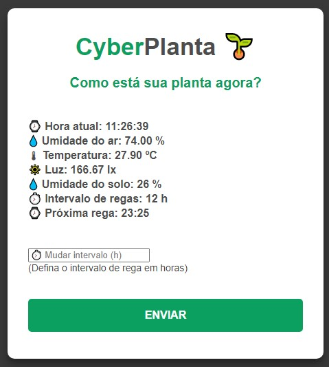

<body>
<h1>CyberPlanta</h1>
<h2>Automação de plantas usando ESP8266</h2>
<h3>Inclui monitoração de:  
- Temperatura ambiente 
- Umidade do ar 
- Incidência de luz ambiente 
- Umidade do solo  
<b>Além de agendar o intervalo de regas da sua planta!</b>
</h3>
  
Componentes necessários:  
- ESP8266 (nodeMCU) 
- Sensor DHT11 (serve o DHT22 também, mas precisa mudar no código) 
- Sensor BH1750 
- Resistor 4,7k 
- Sensor de umidade do solo (o do garfinho) 
- Relé (de preferência o módulo) 
- Bomba hidráulica DC (pode ser de aquário) 
- Cabinhos duPont (também chamados de "jumpers") 
- Protoboard (para ficar organizado)  

</body>
